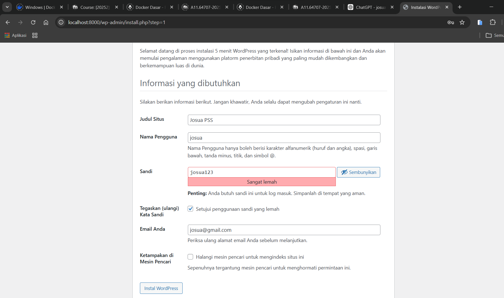
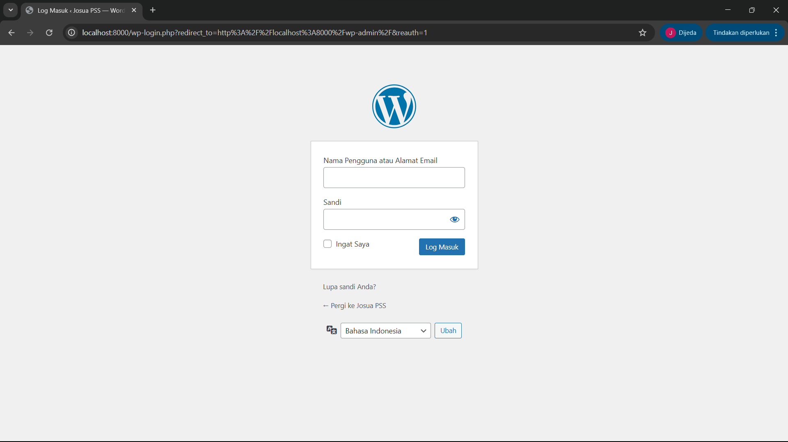
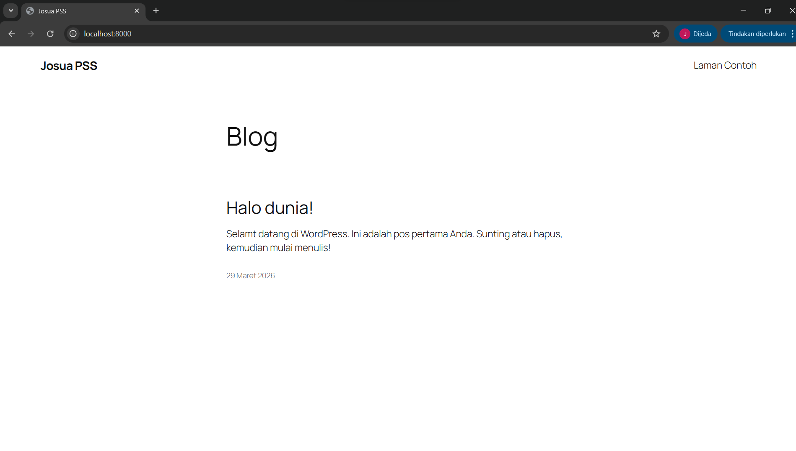
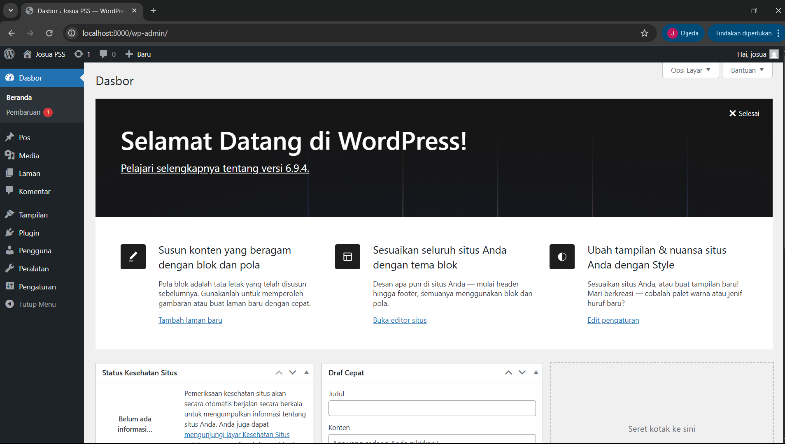
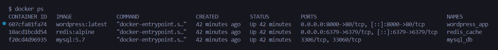
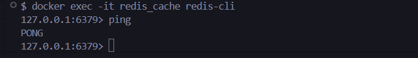

WordPress Docker Compose (MySQL + Redis)

Langkah-langkah Menjalankan Stack :
1. Masuk ke folder project
2. Jalankan Docker Compose
docker-compose up -d
4. Cek container berjalan
docker ps
5. Akses WordPress melalui browser
http://localhost:8000
6. Lakukan instalasi WordPress melalui halaman web

Screenshot
1. WordPress Installation Page

2. Login Admin WordPress

3. WordPress Dashboard

4. Dashboard Admin WordPress

5. Docker Containers Running

6. Redis CLI Ping Test

Jawaban Pertanyaan
1. Kenapa perlu volume untuk MySQL?
Volume diperlukan agar data database tetap tersimpan meskipun container dihentikan atau dihapus. Tanpa volume, data akan hilang karena container bersifat sementara.
2. Apa fungsi depends_on?
depends_on digunakan untuk mengatur urutan startup container. Dengan konfigurasi ini, WordPress akan dijalankan setelah MySQL dan Redis berjalan.
3. Bagaimana cara WordPress container connect ke MySQL?
WordPress terhubung ke MySQL menggunakan hostname mysql, yaitu nama service pada Docker Compose. Docker menyediakan DNS internal sehingga container dapat saling berkomunikasi menggunakan nama tersebut.
4. Apa keuntungan pakai Redis untuk WordPress?
Redis digunakan sebagai object cache yang dapat meningkatkan performa WordPress dengan cara mempercepat loading website, mengurangi beban database, dan mengoptimalkan query yang berulang.